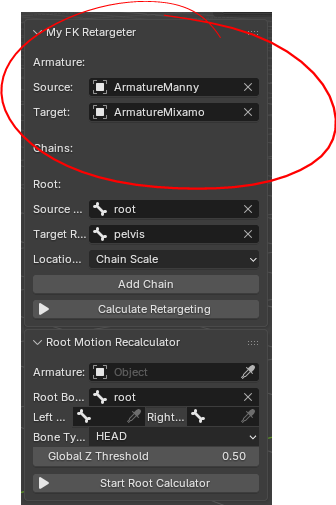
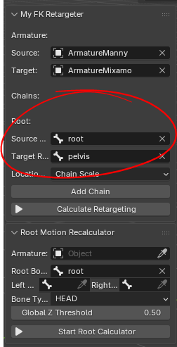
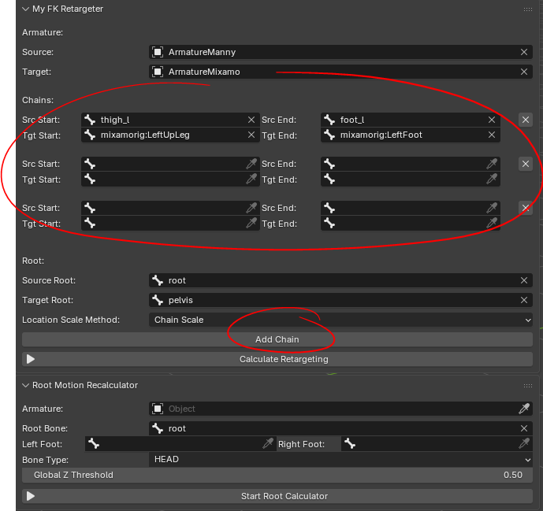

# Blender FK Retargeter

This add-on was developed for Blender 5.0 and later.

To install it, open Edit → Preferences, then go to the Add-ons tab. In the top-right corner, click Install from Disk and select the Retargeter&RootMotionReconAddOn ZIP file.

This will install both the Retargeter and Root Motion Recon add-ons.

After installation, the add-on will appear in the Sidebar.

1. First, in the Source section, select the armature with the animation you want to retarget. Then, in the Target section, select the destination armature to which the animation should be retargeted.

    

2. In the Root section, set the Source Root and Target Root to the highest bone in each armature's hierarchy. For the Unreal Engine Mannequin, for example, this is usually the Root bone.

    

3. When you click Add Chain, text fields will appear where you can define the bone chains for both the Source and Target armatures.

    Make sure to start with the bone that is higher in the hierarchy and end with its child bone. The last bone must be part of the joint chain; otherwise, the system will report an error.

    If you want to perform a 1:1 retarget, simply select the same bone for both the Source and Target.

    

4. Under Location Scale Method, you can choose between different    scaling methods:

    - Bone Scale: Use this if the individual bone sizes differ significantly between the source and target armatures.

    - Chain Scale: Use this if the overall lengths of the bone chains differ significantly.

    - Bone Scale + Chain Scale: Use this if both bone sizes and chain lengths cause issues.

    If you're unsure which method to use, try each option and choose the one that produces the best-looking result.

5. Once you've finished setting everything up, click Calculate Retargeting. A dialog will appear where you can specify the frame range for the retargeting process.

    After confirming the frame range, the add-on will retarget the animation.