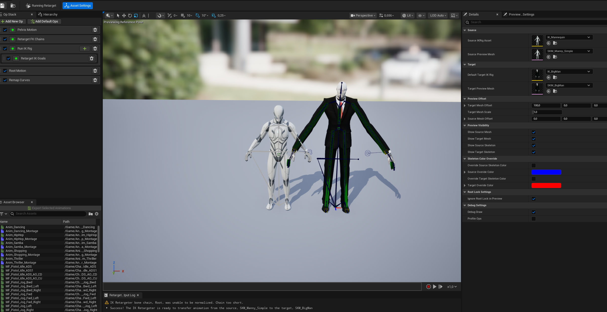
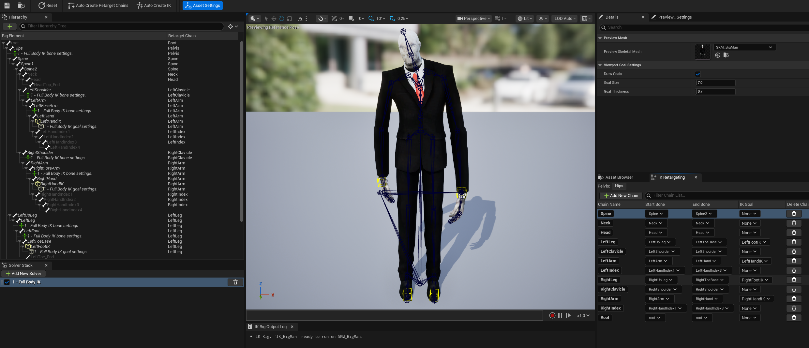

# Retargeting in UE

This Unreal Engine project demonstrates several animation retargeting scenarios across different characters. It showcases various techniques used to minimize and prevent foot sliding issues that can occur during the retargeting process.

You can find the different retargeting examples in the Retargeting folder. The files are named 
- UE_RET-01
- UE_RET-02
- UE_RET-03.

1. In the parameters, assign the IK Rig of the Mannequin and the IK Rig of your character respectively.

    This step defines the mapping of the corresponding joints between the two rigs.

2.  Create your joint chains. For human skeletons, it is recommended to follow the same structure as the Mannequin:

- Spine
- Legs
- Arms
- Neck
- Head (separated from the Neck)

- The Clavicle bones should be handled separately, as they can contain translation values in addition to rotation.

In the lower-left section, create a Full Body IK solver by clicking + Add New Solver.

3. Select the end joint of the hand and leg chains, which in most cases are the hand and foot bones. Right-click on the selected joint and choose New IK Goal to create an IK chain from it.

    Select the entire joint chain (here, for example, shoulder to right hand) while having Full Body IK selected at the bottom. Right-click on one of the joints and you can apply Full Body IK to it using "Add settings to selected bone".

    It creates a more natural deformation and lets the IK solver affect the connected joints while maintaining the overall pose.

4. Afterward, open the Animation Blueprint (ABP) of each retargeted character. In the Anim Graph, connect the corresponding retargeting asset (UE_RET-01, UE_RET-02, or UE_RET-03) to the Output Pose node.

    In the Blueprint of the respective character, the Skeletal Mesh needs to be attached as a child component of the Mannequin.

    The Mannequin itself should be hidden by searching for Visible in the Details panel and disabling this option.

    After that, the previously created Animation Blueprint (ABP) can be assigned. This ABP only consists of the Retarget Pose from Mesh node.
    
    The character should now be playable and has inherited all the logic from the mannequin.

