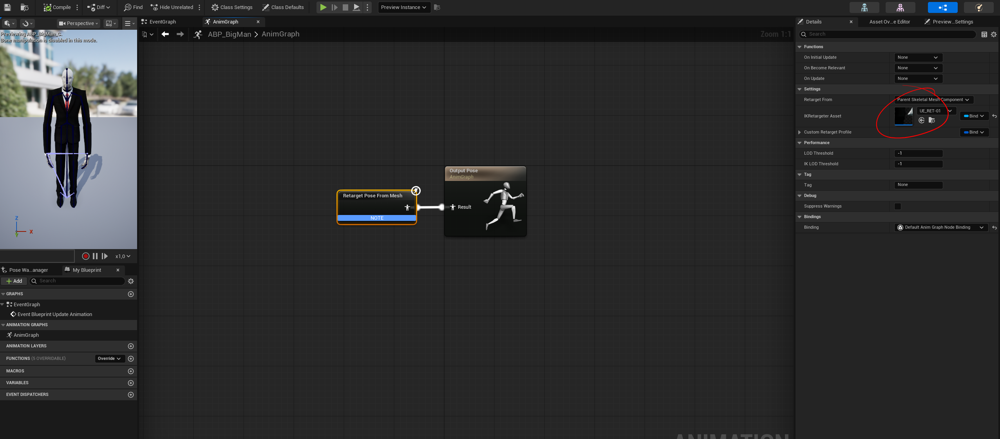
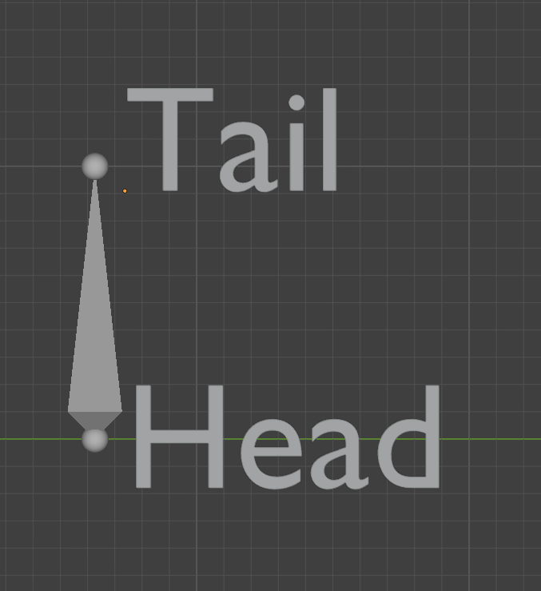

# Blender FK Retargeter Add On

This add-on was developed for Blender 5.0 and later.

To install it, open Edit → Preferences, then go to the Add-ons tab. In the top-right corner, click Install from Disk and select the Retargeter&RootMotionReconAddOn ZIP file.

This will install both the Retargeter and Root Motion Recon add-ons.

After installation, the add-on will appear in the Sidebar.

1. First, in the Source section, select the armature with the animation you want to retarget. Then, in the Target section, select the destination armature to which the animation should be retargeted.

    

2. In the Root section, set the Source Root and Target Root to the highest bone in each armature's hierarchy. For the Unreal Engine Mannequin, for example, this is usually the Root bone.

    

3. When you click Add Chain, text fields will appear where you can define the bone chains for both the Source and Target armatures.

    Make sure to start with the bone that is higher in the hierarchy and end with its child bone. The last bone must be part of the joint chain; otherwise, the system will report an error.

    If you want to perform a 1:1 retarget, simply select the same bone for both the Source and Target.

    

4. Under Location Scale Method, you can choose between different    scaling methods:

    - Bone Scale: Use this if the individual bone sizes differ significantly between the source and target armatures.

    - Chain Scale: Use this if the overall lengths of the bone chains differ significantly.

    - Bone Scale + Chain Scale: Use this if both bone sizes and chain lengths cause issues.

    If you're unsure which method to use, try each option and choose the one that produces the best-looking result.

5. Once you've finished setting everything up, click Calculate Retargeting. A dialog will appear where you can specify the frame range for the retargeting process.

    After confirming the frame range, the add-on will retarget the animation.

For best results, it is recommended to create a separate Root bone in your skeleton hierarchy. This helps ensure a smoother and more reliable retargeting process.

You can find examples of the retargeted results in the included Michailidou_Vu_BA_Retargeting_Testfaelle.blend file.
_____________________________________________________________________

# Blender Root Motion Recalculation Add On

The Root Motion Recalculator creates root motion for your animation if the existing root motion is broken or if you only have an in-place animation.

It is recommended to remove the transformations from the root bone before recalculating the root motion.
 
1. In the Armature section, select the skeleton whose root motion should be recalculated and specify its root bone in the corresponding text field. 
    

2. Now select the foot bones for Left Foot and Right Foot. The Ball bone is recommended here, as it is usually aligned parallel to the ground.

    In Global Z Threshold, you can define the distance to the ground. If the foot position falls below this value, it will be detected as making contact with the ground.

    The foot stores the first frame at which contact occurs and compensates for sliding movement by adjusting the root motion accordingly.

3. Optionally, you can choose between Head and Tail under Bone Type.

    This determines whether the system calculates the threshold based on the tip of the bone (Tail) or the base of the bone (Head).
    

Once you are finished, click Start Root Calculator. A window will appear asking you to specify the frame range for the reconstruction.

After confirming again, the animation should now have a generated root motion.

In the Michailidou_Vu_BA_RootMotionAddOn.blend file, you can view several example results.
_____________________________________________________________________

# Blender Foot Plant Add On

The Blender Foot Plant Add-on is provided as a separate ZIP file and therefore needs to be installed separately.

Since it was developed for Blender 5.0 or later, it is recommended to use this version of Blender.

In Blender, go to Edit → Preferences, select Add-ons from the menu on the left, and click Install from Disk... in the upper-right corner. Then select the FootPlantAddOn.zip file.

Once the installation is complete, the add-on will appear in the Sidebar and is ready to use.

With the Foot Plant Add-on, the artist defines the frame range during which the feet should remain planted and not slide. Throughout this interval, the feet are anchored in place to prevent foot sliding.

The add-on requires an IK (Inverse Kinematics) rig and does not work with FK (Forward Kinematics).

1. First, under Target Rig, select the rig that contains the animation you want to process with the add-on and klick on Load Target Bones

2. Click Add Interval (Left/Right) to define the frame range during which the foot should remain planted.

    Next, select the corresponding end effector for each leg, as well as the toe bone. The toe bone is used to correct vertical foot sliding. This correction requires the Foot Roll Correction option to be enabled.

    Once everything has been configured, click Run Foot Plant to apply the foot planting.
